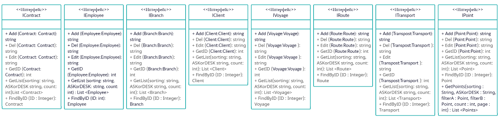

# Транспортная компания

## Схема интерфейсов
 
 
### ***Список интерфейсов***
- [IBranch](docs/IBranch.md) 

- [IEmployee](docs/IEmployee.md) 

- [IClient](docs/IClient.md)

- [IContract](docs/IContract.md)

- [IVoyage](docs/IVoyage.md)

- [IRoute](docs/IRoute.md)

- [IPoint](docs/IPoint.md)

- [ITransport](docs/ITransport.md)

 
## Диаграммы

+ [Диаграмма размещения](docs/Deployment.md)

+ [Диаграммы последовательности](docs/Sequence.md)

+ [Диаграммы действий](docs/Activity.md)

+ [Диаграмма состояния](docs/State.md)

+ [Диаграмма классов](docs/Class.md)

+ [Диаграмма компонентов](docs/Comp.md)

+ [Схема БД](docs/BD.md)

+ [Схема прецедентов](docs/Precedent.md)
