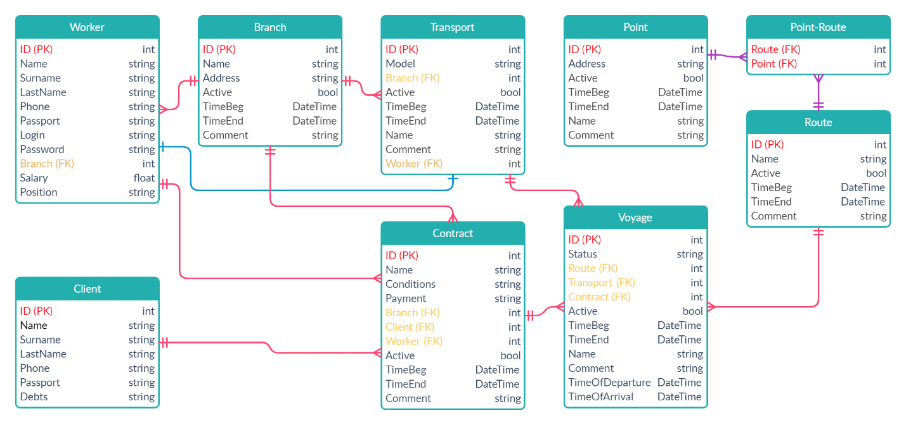

## База данных
 

### Описание таблиц

**Worker**

+ Таблица для хранения сотрудников
+ Первичный ключ - ID
+ Связь «многие-к-одному»: Branch, Contract
+ Связь «один-к-одному»: Transport

+ Элементы таблицы:
	*	ID (PK): int	Идентификатор
	*	Name: string	Имя
	* Surname: string	Фамилия
	* LastName: string	Отчество
	* Phone: string	Номер телефона
	* Passport: string	Паспортные данные
	* Login: string	Логин
	* Password: string	Пароль
	* Branch (FK): int	Филиал
	* Salary: float	Зарплата
	* Position	Должность

**Client**

+ Таблица для хранения клиентов
+ Первичный ключ - ID
+ Связь «многие-к-одному»:	Contract

+ Элементы таблицы:
	* ID (PK): int	Идентификатор
	* Name: string	Имя
	* Surname: string	Фамилия
	* LastName: string	Отчество
	* Phone: string	Номер телефона
	* Passport: string	Паспортные данные
	* Debts: string	Долги

**Contract**

+ Таблица для хранения договоров
+ Первичный ключ	ID
+ Связь «один-ко-многим»	Voyage
+ Связь «многие-к-одному»	Branch, Worker, Client

+ Элементы таблицы
	* ID (PK): int	Идентификатор
	* Name: string	Название или номер договора
	* Conditions: string	Условия договора (перевозки)
	* Payment: string	Сумма договора
	* Branch (FK): int	Филиал
	* Voyage (FK): int	Рейс
	* Active: bool	Статус активности
	* TimeBeg: DateTime	Дата начала исполнения договора
	* TimeEnd: DateTime	Дата окончания исполнения договора
	* Comment: string	Комментарий

**Branch**

+ Таблица для хранения филиалов
+ Первичный ключ	ID
+ Связь «один-ко-многим»	Worker, Transport, Contract

+ Элементы таблицы
	* ID (PK): int	Идентификатор
	* Name: string	Название
	* Address: string	Адрес
	* DateBeg: DateTime	Дата начала функционирования
	* DateEnd: DateTime	Дата окончания функционирования
	* Active: bool	Статус активности
	* Comment: string	Комментарий

**Transport**

+ Таблица для хранения транспортных средств
+ Первичный ключ	ID
+ Связь «один-ко-многим»	Voyage
+ Связь «один-к-одному»	Worker
+ Связь «многие-к-одному»	Branch

+ Элементы таблицы
	* ID (PK): int	Идентификатор
	* Model: string	Модель авто
	* Branch (FK): int	Филиал
	* Worker (FK): int	Водитель
	* Active: bool	Статус активности
	* TimeBeg: DateTime	Дата начала эксплуатации авто
	* TimeEnd: DateTime	Дата окончания эксплуатации авто
	* Comment: string	Комментарий
	* Name: string	Гос. номер

**Voyage**

+ Таблица для хранения рейсов
+ Первичный ключ	ID
+ Связь «один-ко-многим»	Voyage-Transport, Contract
+ Связь «многие-к-одному»	Route

+ Элементы таблицы
	* ID (PK): int	Идентификатор
	* Status: string	Статус рейса
	* Active: bool	Статус активности
	* Route (FK): int	Маршрут
	* Transport (FK) : int	Транспорт
	* TimeBeg: DateTime	Дата начала рейса
	* TimeEnd: DateTime	Дата окончания рейса
	* Comment: string	Комментарий
	* Name: string	Название рейса

**Route**

+ Таблица для хранения маршрутов
+ Первичный ключ	ID
+ Связь «один-ко-многим»	Point, Voyage

+ Элементы таблицы
	* ID (PK): int	Идентификатор
	* Active: bool	Статус активности
	* TimeBeg: DateTime	Дата начала использования маршрута
	* TimeEnd: DateTime	Дата окончания использования маршрута
	* Comment: string	Комментарий
	* Name: string	Название

**Point**

+ Таблица для хранения точек, из которых состоит маршрут
+ Первичный ключ	ID
+ Связь «многие-ко-многим»	Route

+ Элементы таблицы
	* ID (PK): int	Идентификатор
	* Address : string	Адрес
	* TimeOfDeparture: DateTime	Время отправления с точки
	* TimeOfArrival: DateTime	Время прибытия на точку
	* Route (FK): int	Маршрут
	* Active: bool	Статус активности
	* TimeBeg: DateTime	Дата начала использования точки
	* TimeEnd: DateTime	Дата окончания использования точки
	* Comment: string	Комментарий
	* Name: string	Название
