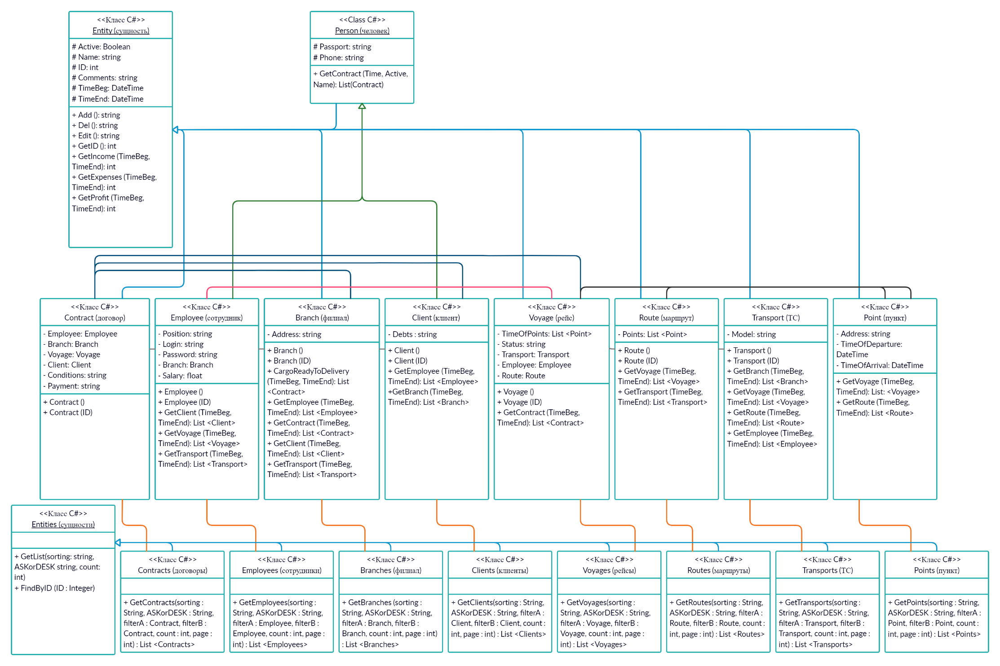

## Диаграмма классов

### Описание классов

#### *Entity* (сущность)
+ Абстрактный и статический класс, является родительским для Person, Contract, Branch, Voyage, Route, Transport и Point.
+ Атрибуты:
	* Active: Boolean – активен ли объект
	* Name: string – название 
	* ID: int - ID
	* Comments: string - комментарии
	* TimeBeg: DateTime – дата начала деятельности объекта
	* TimeEnd: DateTime – дата окончания деятельности объекта
+ Функции:
	* +Add (): string – добавление в БД
	* +Del (): string – удаление из БД
	* +Edit (): string – Редактирование в БД
	* +GetID (): int – Получение ID
	* +GetIncome (TimeBeg, TimeEnd): int – Получение дохода
	* +GetExpenses (TimeBeg, TimeEnd): int – Получение издержек
	* +GetProfit (TimeBeg, TimeEnd): int – Получение прибыли

#### *Person* (человек)
+ Абстрактный и статический класс, является родительским для Employee и Client, наследником для Entities.
+ Атрибуты:
	* Passport: string - пасспорт
	* Phone: string - телефон
+ Функции:
	* +GetContract (Time, Active, Name): List(Contract) -  получить список договоров для объекта

#### *Contract* (договор)
+ Класс-наследник Entity. Описывает договор.
+ Атрибуты:
	* Employee: Employee - сотрудник
	* Branch: Branch - филиал
	* Voyage: Voyage - рейс
	* Client: Client - клиент
	* Conditions: string – условия доставки
	* Payment: string - оплата
+ Функции:
	* +Contract () – конструтор класса
	* +Contract (ID) – получить экземпляра из БД по ID

#### *Employee* (сотрудник)
+ Класс-наследник Person. Описывает сотрудника.
+ Атрибуты:
	* Position: string - должность
	* Login: string - логин
	* Password: string - пароль
	* Branch: Branch - филиал
	* Salary: float - зарплата
+ Функции:
	* +Employee () – конструктор класса
	* +Employee (ID) – получить экземпляр из БД по ID
	* +GetClient (TimeBeg, TimeEnd): List <Client>  -  получить список клиентов для объекта
	* +GetVoyage (TimeBeg, TimeEnd): List <Voyage> -  получить список рейсов для объекта
	* +GetTransport (TimeBeg, TimeEnd): List <Transport> -  получить список ТС для объекта

#### *Branch* (филиал)
+ Класс-наследник Entity. Описывает филиал.
+ Атрибуты:
	* Address: string – адрес 
+ Функции:
	* +Branch () – конструктор класса
	* +Branch (ID) – получить экзепляр из БД по ID
	* +CargoReadyToDelivery (TimeBeg, TimeEnd): List <Contract> -  получить список готовых к отправке грузов для объекта
	* +GetEmployee (TimeBeg, TimeEnd): List <Employee> -  получить список сотрудников для объекта
	* +GetContract (TimeBeg, TimeEnd): List <Contract> -  получить список договоров для объекта
	* +GetClient (TimeBeg, TimeEnd): List <Client> -  получить список клиентов для объекта
	* +GetTransport (TimeBeg, TimeEnd): List <Transport> -  получить список ТС для объекта

#### *Client* (клиент)
+ Класс-наследник Person. Описывает клиента.
+ Атрибуты:
	* Debts : string - долги
+ Функции:
	* +Client () – конструктор класса
	* +Client (ID) – получить экземпляр из БД по ID
	* +GetEmployee (TimeBeg, TimeEnd): List <Employee> -  получить список сотрудников для объекта
	* +GetBranch (TimeBeg, TimeEnd): List <Branch> -  получить список филиалов для объекта

#### *Voyage* (рейс)
+ Класс-наследник Entity. Описывает рейс.
+ Атрибуты:
	* TimeOfPoints: List <Point> - лист пунктов со временем прибытия в пункт и отправления из него
	* Status: string – статутс (getting ready, en route, arrived)
	* Transport: Transport - транспорт
	* Employee: Employee - работник
	* Route: Route - маршрут
+ Функции:
	* +Voyage () – конструктор класса
	* +Voyage (ID) – получить экземпляр из БД по ID
	* +GetContract (TimeBeg, TimeEnd): List <Contract> -  получить список договоров для объекта

#### *Route* (маршрут)
+ Класс-наследник Entity. Описывает маршрут.
+ Атрибуты:
	* Points: List <Point> - лист пунктов
+ Функции:
	* +Route () – конструктор класса
	* +Route (ID) – получить экземпляр из БД по ID
	* +GetVoyage (TimeBeg, TimeEnd): List <Voyage> -  получить список рейсов для объекта
	* +GetTransport (TimeBeg, TimeEnd): List <Transport> -  получить список ТС для объекта

#### *Transport* (ТС)
+ Класс-наследник Entity. Описывает ТС.
+ Атрибуты:
	* Model: string – модель
+ Функции:
	* +Transport () – конструтор класса
	* +Transport (ID) – получить экземпляр из БД по ID
	* +GetBranch (TimeBeg, TimeEnd): List <Branch> -  получить список филиалов для объекта
	* +GetVoyage (TimeBeg, TimeEnd): List <Voyage> -  получить список рейсов для объекта
	* +GetRoute (TimeBeg, TimeEnd): List <Route> -  получить список маршрутов для объекта
	* +GetEmployee (TimeBeg, TimeEnd): List <Employee> -  получить список работники для объекта
	
#### *Point* (пункт)
+ Класс-наследник Entity. Описывает пункт.
+ Атрибуты:
	* Address: string – адрес
	* TimeOfDeparture: DateTime – время прибытия в пункт
	* TimeOfArrival: DateTime – время отправления из пункта
+ Функции:
	* +GetVoyage (TimeBeg, TimeEnd): List: <Voyage> -  получить список рейсов для объекта
	* +GetRoute (TimeBeg, TimeEnd): List <Voyage> - получить список маршрутов для объекта

#### *Entities* (сущности)
+ Абстрактный и статический класс, является родительским для Employees, Clients, Contracts, Branches, Voyages, Routes, Transports и Points.
+ Функции:
	* +GetList (sorting : String, ASKorDESK : String, filterA : T, filterB : A, count : int, page : int) – функция с входными параметрами «sorting»(сортировка), «ASKofDESK»(по возрастанию или по убыванию), «filterA», «filterB»(фильтр), «count»(количество), «page»(страница). Второй фильтр (filter B) необходим для интервала количественных атрибутов. Функция возвращает список объектов класса-наследника.
	* +FindByID (ID : Integer) – поиск экземпляра класса-наследника по ID

#### *Contracts* (договоры)
+ Класс-наследник Entities. Описывает договоры.
+ Функции:
	* +GetContracts(sorting : String, ASKorDESK : String, filterA : Contract, filterB : Contract, count : int, page : int) : List <Contracts> - функция с входными параметрами «sorting»(сортировка), «ASKofDESK»(по возрастанию или по убыванию), «filterA», «filterB»(фильтр), «count»(количество), «page»(страница). Второй фильтр (filter B) необходим для интервала количественных атрибутов. Функция возвращает список договоров.

#### *Employees* (сотрудники)
+ Класс-наследник Entities. Описывает сотрудников.
+ Функции:
	* +GetEmployees(sorting : String, ASKorDESK : String, filterA : Employee, filterB : Employee, count : int, page : int) : List <Employees> - функция с входными параметрами «sorting»(сортировка), «ASKofDESK»(по возрастанию или по убыванию), «filterA», «filterB»(фильтр), «count»(количество), «page»(страница). Второй фильтр (filter B) необходим для интервала количественных атрибутов. Функция возвращает список сотрудников.

#### *Branches* (филиал)
+ Класс-наследник Entities. Описывает филиалы.
+ Функции:
	* +GetBranches (sorting : String, ASKorDESK : String, filterA : Branch, filterB : Branch, count : int, page : int) : List <Branches> - функция с входными параметрами «sorting»(сортировка), «ASKofDESK»(по возрастанию или по убыванию), «filterA», «filterB»(фильтр), «count»(количество), «page»(страница). Второй фильтр (filter B) необходим для интервала количественных атрибутов. Функция возвращает список филиалов.

#### *Clients* (клиенты)
+ Класс-наследник Entities. Описывает клиентов.
+ Функции:
	* +GetClients(sorting : String, ASKorDESK : String, filterA : Client, filterB : Client, count : int, page : int) : List <Clients> - функция с входными параметрами «sorting»(сортировка), «ASKofDESK»(по возрастанию или по убыванию), «filterA», «filterB»(фильтр), «count»(количество), «page»(страница). Второй фильтр (filter B) необходим для интервала количественных атрибутов. Функция возвращает список клиентов.

#### *Voyages* (рейсы)
+ Класс-наследник Entities. Описывает рейсы.
+ Функции:
	* +GetVoyages(sorting : String, ASKorDESK : String, filterA : Voyage, filterB : Voyage, count : int, page : int) : List <Voyages> - функция с входными параметрами «sorting»(сортировка), «ASKofDESK»(по возрастанию или по убыванию), «filterA», «filterB»(фильтр), «count»(количество), «page»(страница). Второй фильтр (filter B) необходим для интервала количественных атрибутов. Функция возвращает список рейсы.

#### *Routes* (маршруты)
+ Класс-наследник Entities. Описывает маршруты.
+ Функции:
	* +GetRoutes(sorting : String, ASKorDESK : String, filterA : Route, filterB : Route, count : int, page : int) : List <Routes> - функция с входными параметрами «sorting»(сортировка), «ASKofDESK»(по возрастанию или по убыванию), «filterA», «filterB»(фильтр), «count»(количество), «page»(страница). Второй фильтр (filter B) необходим для интервала количественных атрибутов. Функция возвращает список маршруты.

#### *Transports* (ТС)
+ Класс-наследник Entities. Описывает ТС.
+ Функции:
	* +GetTransports(sorting : String, ASKorDESK : String, filterA : Transport, filterB : Transport, count : int, page : int) : List <Transports> - функция с входными параметрами «sorting»(сортировка), «ASKofDESK»(по возрастанию или по убыванию), «filterA», «filterB»(фильтр), «count»(количество), «page»(страница). Второй фильтр (filter B) необходим для интервала количественных атрибутов. Функция возвращает список ТС.

#### *Points* (пункты)
+ Класс-наследник Entities. Описывает пункты.
+ Функции:
	* +GetPoints(sorting : String, ASKorDESK : String, filterA : Point, filterB : Point, count : int, page : int) : List <Points> - функция с входными параметрами «sorting»(сортировка), «ASKofDESK»(по возрастанию или по убыванию), «filterA», «filterB»(фильтр), «count»(количество), «page»(страница). Второй фильтр (filter B) необходим для интервала количественных атрибутов. Функция возвращает список пунтов.
