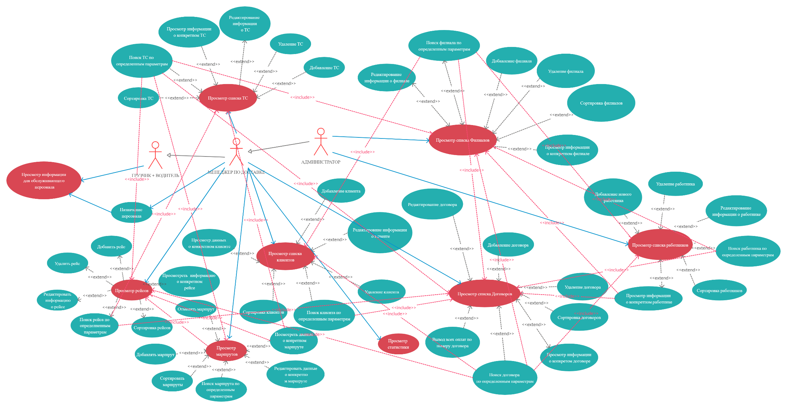

## Диаграмма прецедентов 

 

**Пункт 1 Посмотреть заказы клиентов**
+ *Имя прецедентов:*	Просмотреть заказы клиентов 
+ *Краткое описание:*	Прецедент позволяет просматривать список всех заказов
+ *Актеры:*	Администратор, Директор 
+ *Предусловия:*	-
+ *Основной поток:*	Выводится информация о текущих, а также и завершившихся заказах
+ *Постусловия:*	Если прецедент был успешен завершён, то пользователь может выполнять другие действия
+ *Альтернативные потоки:* 	-

**Просмотр списка клиентов**
+ *Краткое описание:*	Прецедент позволяет просматривать список всех клиентов
+ *Акторы:*	Администратор, Менеджер по доставке
+ *Предусловия:*	-
+ *Основной поток:*	Выводится информация обо всех клиентах в виде таблицы
+ *Постусловия:*	Если прецедент был успешно завершен, то пользователь может выполнять другие действия.
+ *Альтернативные потоки:* -

**Просмотр данных о конкретном клиенте**
+ *Краткое описание:*	Прецедент позволяет просматривать данные о конкретном клиенте.
+ *Акторы:*	Администратор, Менеджер по доставке
+ *Предусловия:*	Должен быть выполнен прецедент “Просмотр списка клиентов”
+ *Основной поток:*	Выводится информация о клиенте в виде таблицы
+ *Постусловия:*	Если прецедент был успешно завершен, то пользователь может выполнять другие действия.
+ *Альтернативные потоки:*	-

**Добавление клиента**
+ *Краткое описание:*	Прецедент позволяет добавлять новых клиентов
+ *Акторы:*	Администратор, Менеджер по доставке
+ *Предусловия:*	Должен быть выполнен прецедент “Просмотр списка клиентов”
+ *Основной поток:*	Открывается форма добавления нового клиента, куда заносятся все необходимые данные.
+ *Постусловия:*	Если прецедент был успешно завершен, то форма добавления клиента закрывается, и в БД добавляется новый клиент.
+ *Альтернативные потоки:*	Если имеются пустые поля, либо введены некорректные данные, то пользователю выдается сообщение об ошибке и дается возможность исправить данные.

**Изменение данных о клиенте**
+ *Краткое описание:*	Прецедент позволяет редактировать данные о клиенте
+ *Акторы:*	Администратор, Менеджер по доставке
+ *Предусловия:*	Должен быть выполнен прецедент “Просмотр списка клиентов”
+ *Основной поток:*	Открывается форма редактирования клиента, где изменяются необходимые данные.
+ *Постусловия:*	Если прецедент был успешно завершен, то форма редактирования клиента закрывается, и измененные данные о клиенте сохраняются
+ *Альтернативные потоки:*	Если имеются пустые поля, либо введены некорректные данные, то пользователю выдается сообщение об ошибке и дается возможность исправить данные.

**Удаление клиента**
+ *Краткое описание:*	Прецедент позволяет удалять клиента из БД
+ *Акторы:*	Администратор, Менеджер по доставке
+ *Предусловия:*	Должен быть выполнен прецедент “Просмотр списка клиентов”
+ *Основной поток:*	При нажатии на кнопку “Удалить”, текущая запись удаляется. 
+ *Постусловия:*	Если прецедент был успешно завершен, то клиент удаляется из базы данных.
+ *Альтернативные потоки:*	-

**Поиск клиента по определенным параметрам**
+ *Краткое описание:*	Прецедент позволяет осуществлять поиск клиента по определенным параметрам
+ *Акторы:*	Администратор, Менеджер по доставке
+ *Предусловия:*	Должен быть выполнен прецедент “Просмотр списка клиентов”
+ *Основной поток:*	Выводится форма выбора параметров по которым будет осуществлен поиск, а затем будет показаны клиенты в алфавитном порядке / по возрастанию.
+ *Постусловия:*	Если прецедент был успешно завершен, то пользователь может выполнять другие действия.
+ *Альтернативные потоки:*	Если имеются пустые поля, либо введены некорректные данные, то пользователю выдается сообщение об ошибке и дается возможность исправить данные.

**Сортировка клиентов**
+ *Краткое описание:*	Прецедент позволяет осуществлять сортировку клиентов по определенным параметрам
+ *Акторы:*	Администратор, Менеджер по доставке
+ *Предусловия:*	Должен быть выполнен прецедент “Просмотр списка клиентов”
+ *Основной поток:*	Выводится форма выбора параметров по которым будет осуществлена сортировка, а затем будет показаны клиенты в алфавитном порядке / по возрастанию.
+ *Постусловия:*	Если прецедент был успешно завершен, то пользователь может выполнять другие действия.
+ *Альтернативные потоки:*	Если имеются пустые поля, либо введены некорректные данные, то пользователю выдается сообщение об ошибке и дается возможность исправить данные.

**Просмотр списка ТС**
+ *Краткое:* описание	Прецедент позволяет просматривать список всех ТС
+ *Акторы:*	Администратор, Менеджер по доставке
+ *Предусловия:*	-
+ *Основной поток:*	Выводится информация обо всех ТС в виде таблицы.
+ *Постусловия:*	Если прецедент был успешно завершен, то пользователь может выполнять другие действия.
+ *Альтернативные потоки:*	-

**Добавление ТС**
+ *Краткое описание:*	Прецедент позволяет добавлять новые ТС
+ *Акторы:*	Администратор, Менеджер по доставке
+ *Предусловия:*	Должен быть выполнен прецедент “Просмотр списка ТС”
+ *Основной поток:*	Открывается форма добавления ТС, куда вносятся необходимые данные.
+ *Постусловия:*	Если прецедент был успешно завершен, то в БД добавляется новое ТС.
+ *Альтернативные потоки:*	Если имеются пустые поля, либо введены некорректные данные, то пользователю выдается сообщение об ошибке и дается возможность исправить данные.

**Изменение данных о ТС**
+ *Краткое описание:*	Прецедент позволяет редактировать данные о ТС
+ *Акторы:*	Администратор, Менеджер по доставке
+ *Предусловия:*	Должен быть выполнен прецедент “Просмотр списка ТС”
+ *Основной поток:*	Открывается форма редактирования ТС, где изменяются необходимые данные.
+ *Постусловия:*	Если прецедент был успешно завершен, то форма редактирования ТС закрывается, и измененные данные сохраняются
+ *Альтернативные потоки:*	Если имеются пустые поля, либо введены некорректные данные, то пользователю выдается сообщение об ошибке и дается возможность исправить данные.

**Удаление ТС**
+ *Краткое описание:*	Прецедент позволяет удалять ТС
+ *Акторы:*	Администратор, Менеджер по доставке
+ *Предусловия:*	Должен быть выполнен прецедент “Просмотр списка ТС”
+ *Основной поток:*	При нажатии на кнопку “Удалить”, текущее ТС удаляется.
+ *Постусловия:*	Если прецедент был успешно завершен, то ТС удаляется из базы данных.
+ *Альтернативные потоки:*	-

**Просмотр данных о конкретном ТС**
+ *Краткое описание:*	Прецедент позволяет просматривать данные о конкретном ТС.
+ *Акторы:*	Администратор, Менеджер по доставке
+ *Предусловия:*	Должен быть выполнен прецедент “Просмотр списка ТС”
+ *Основной поток:*	Выводится информация о ТС в виде таблицы
+ *Постусловия:*	Если прецедент был успешно завершен, то пользователь может выполнять другие действия.
+ *Альтернативные потоки:*	-

**Поиск ТС по определенным параметрам**
+ *Краткое описание:*	Прецедент позволяет осуществлять поиск ТС по определенным параметрам
+ *Акторы:*	Администратор, Менеджер по доставке
+ *Предусловия:*	Должен быть выполнен прецедент “Просмотр списка ТС”
+ *Основной поток:*	Выводится форма выбора параметров по которым будет осуществлен поиск, а затем будет показаны ТС в алфавитном порядке / по возрастанию.
+ *Постусловия:*	Если прецедент был успешно завершен, то пользователь может выполнять другие действия.
+ *Альтернативные потоки:*	Если имеются пустые поля, либо введены некорректные данные, то пользователю выдается сообщение об ошибке и дается возможность исправить данные.

**Сортировка ТС**
+ *Краткое описание:*	Прецедент позволяет осуществлять сортировку ТС по определенным параметрам
+ *Акторы:*	Администратор, Менеджер по доставке
+ *Предусловия:*	Должен быть выполнен прецедент “Просмотр списка ТС”
+ *Основной поток:*	Выводится форма выбора параметров по которым будет осуществлена сортировка, а затем будет показаны ТС в алфавитном порядке / по возрастанию.
+ *Постусловия:*	Если прецедент был успешно завершен, то пользователь может выполнять другие действия.
+ *Альтернативные потоки:*	Если имеются пустые поля, либо введены некорректные данные, то пользователю выдается сообщение об ошибке и дается возможность исправить данные.

**Просмотр списка филиалов**
+ *Краткое описание:*	Прецедент позволяет просматривать список всех филиалов
+ *Акторы:*	Администратор
+ *Предусловия:*	-
+ *Основной поток:*	Выводится информация обо всех филиалах в виде таблицы. 
+ *Постусловия:*	Если прецедент был успешно завершен, то пользователь может выполнять другие действия.
+ *Альтернативные потоки:*	-

**Добавление филиала**
+ *Краткое описание:*	Прецедент позволяет добавлять новые филиалы
+ *Акторы:*	Администратор
+ *Предусловия:*	Должен быть выполнен прецедент “Просмотр списка филиалов”
+ *Основной поток:*	Открывается форма добавления филиала, куда вносятся необходимые данные.
+ *Постусловия:*	Если прецедент был успешно завершен, то в БД добавляется новый филиал.
+ *Альтернативные потоки:*	Если имеются пустые поля, либо введены некорректные данные, то пользователю выдается сообщение об ошибке и дается возможность исправить данные.

**Изменение данных о филиале**
+ *Краткое описание:*	Прецедент позволяет редактировать данные о филиале
+ *Акторы:*	Администратор
+ *Предусловия:*	Должен быть выполнен прецедент “Просмотр списка филиалов”
+ *Основной поток:*	Открывается форма редактирования филиала, где изменяются необходимые данные.
+ *Постусловия:*	Если прецедент был успешно завершен, то в БД добавляется новая / измененная информация о филиале.
+ *Альтернативные потоки:*	Если имеются пустые поля, либо введены некорректные данные, то пользователю выдается сообщение об ошибке и дается возможность исправить данные.

**Удаление филиала**
+ *Краткое описание:*	Прецедент позволяет удалять филиал
+ *Акторы:*	Администратор
+ *Предусловия:*	Должен быть выполнен прецедент “Просмотр списка филиалов”
+ *Основной поток:*	При нажатии на кнопку “Удалить”, филиал удаляется.
+ *Постусловия:*	Если прецедент был успешно завершен, то филиал удаляется из базы данных.
+ *Альтернативные потоки:*	-

**Сортировка филиалов**
+ *Краткое описание:*	Прецедент позволяет осуществлять сортировку филиалов по определенным параметрам
+ *Акторы:*	Администратор
+ *Предусловия:*	Должен быть выполнен прецедент “Просмотр списка филиалов”
+ *Основной поток:*	Выводится форма выбора параметров по которым будет осуществлена сортировка, а затем будет показаны филиалы в алфавитном порядке / по возрастанию.
+ *Постусловия:*	Если прецедент был успешно завершен, то пользователь может выполнять другие действия.
+ *Альтернативные потоки:*	Если имеются пустые поля, либо введены некорректные данные, то пользователю выдается сообщение об ошибке и дается возможность исправить данные.

**Поиск филиала по определенным параметрам**
+ *Краткое описание:*	Прецедент позволяет осуществлять поиск филиалов по определенным параметрам
+ *Акторы:*	Администратор
+ *Предусловия:*	Должен быть выполнен прецедент “Просмотр списка филиалов”
+ *Основной поток:*	Выводится форма выбора параметров по которым будет осуществлен поиск, а затем будет показаны филиалы в алфавитном порядке / по возрастанию.
+ *Постусловия:*	Если прецедент был успешно завершен, то пользователь может выполнять другие действия.
+ *Альтернативные потоки:*	Если имеются пустые поля, либо введены некорректные данные, то пользователю выдается сообщение об ошибке и дается возможность исправить данные.

**Просмотр данных о конкретном филиале**
+ *Краткое описание:*	Прецедент позволяет просматривать данные о конкретном филиале.
+ *Акторы:*	Администратор
+ *Предусловия:*	Должен быть выполнен прецедент “Просмотр списка филиалов”
+ *Основной поток:*	Выводится информация о филиале в виде таблицы
+ *Постусловия:*	Если прецедент был успешно завершен, то пользователь может выполнять другие действия.
+ *Альтернативные потоки:*	-

**Просмотр списка работников**
+ *Краткое описание:*	Прецедент позволяет просматривать список всех работников
+ *Акторы:*	Администратор
+ *Предусловия:*	-
+ *Основной поток:*	Выводится информация обо всех работниках в виде таблицы. 
+ *Постусловия:*	Если прецедент был успешно завершен, то пользователь может выполнять другие действия.
+ *Альтернативные потоки:*	-

**Добавление работника**
+ *Краткое описание:*	Прецедент позволяет добавлять новых работников
+ *Акторы:*	Администратор
+ *Предусловия:*	Должен быть выполнен прецедент “Просмотр списка работников”
+ *Основной поток:*	Открывается форма добавления работника, куда вносятся необходимые данные.
+ *Постусловия:*	Если прецедент был успешно завершен, то в БД добавляется новый работник.
+ *Альтернативные потоки:*	Если имеются пустые поля, либо введены некорректные данные, то пользователю выдается сообщение об ошибке и дается возможность исправить данные.

**Изменение данных о работнике**
+ *Краткое описание:*	Прецедент позволяет редактировать данные о работнике
+ *Акторы:*	Администратор
+ *Предусловия:*	Должен быть выполнен прецедент “Просмотр списка работников”
+ *Основной поток:*	Открывается форма редактирования работников, где изменяются необходимые данные.
+ *Постусловия:*	Если прецедент был успешно завершен, то в БД добавляется новая / измененная информация о работнике.
+ *Альтернативные потоки:*	Если имеются пустые поля, либо введены некорректные данные, то пользователю выдается сообщение об ошибке и дается возможность исправить данные.

**Удаление работника**
+ *Краткое описание:*	Прецедент позволяет удалять работника
+ *Акторы:*	Администратор
+ *Предусловия:*	Должен быть выполнен прецедент “Просмотр списка работников”
+ *Основной поток:*	При нажатии на кнопку “Удалить”, работник удаляется.
+ *Постусловия:*	Если прецедент был успешно завершен, то работник удаляется из базы данных.
+ *Альтернативные потоки:*	

**Сортировка работников**
+ *Краткое описание:*	Прецедент позволяет осуществлять сортировку работников по определенным параметрам
+ *Акторы:*	Администратор
+ *Предусловия:*	Должен быть выполнен прецедент “Просмотр списка работников”
+ *Основной поток:*	Выводится форма выбора параметров по которым будет осуществлена сортировка, а затем будет показаны работники в алфавитном порядке / по возрастанию.
+ *Постусловия:*	Если прецедент был успешно завершен, то пользователь может выполнять другие действия.
+ *Альтернативные потоки:*	Если имеются пустые поля, либо введены некорректные данные, то пользователю выдается сообщение об ошибке и дается возможность исправить данные.

**Поиск работника по определенным параметрам**
+ *Краткое описание:*	Прецедент позволяет осуществлять поиск работников по определенным параметрам
+ *Акторы:*	Администратор
+ *Предусловия:*	Должен быть выполнен прецедент “Просмотр списка работников”
+ *Основной поток:*	Выводится форма выбора параметров по которым будет осуществлен поиск, а затем будет показаны работники в алфавитном порядке / по возрастанию.
+ *Постусловия:*	Если прецедент был успешно завершен, то пользователь может выполнять другие действия.
+ *Альтернативные потоки:*	Если имеются пустые поля, либо введены некорректные данные, то пользователю выдается сообщение об ошибке и дается возможность исправить данные.

**Просмотр данных о конкретном работнике**
+ *Краткое описание:*	Прецедент позволяет просматривать данные о конкретном работнике.
+ *Акторы:*	Менеджер по доставке, , Администратор, 
+ *Предусловия:*	Должен быть выполнен прецедент “Просмотр списка работников”
+ *Основной поток:*	Выводится информация о работнике в виде таблицы
+ *Постусловия:*	Если прецедент был успешно завершен, то пользователь может выполнять другие действия.
+ *Альтернативные потоки:*	-

**Просмотр списка рейсов**
+ *Краткое описание:*	Прецедент позволяет просматривать список всех рейсов
+ *Акторы:*	Администратор, Менеджер по доставке
+ *Предусловия:* -
+ *Основной поток:*	Выводится информация обо всех рейсах в виде таблицы. 
+ *Постусловия:*	Если прецедент был успешно завершен, то пользователь может выполнять другие действия.
+ *Альтернативные потоки:*	-

**Добавление рейса**
+ *Краткое описание:*	Прецедент позволяет добавлять новые рейсы
+ *Акторы:*	Администратор, Менеджер по доставке
+ *Предусловия:*	Должен быть выполнен прецедент “Просмотр списка рейсов”
+ *Основной поток:*	Открывается форма добавления рейса, куда вносятся необходимые данные.
+ *Постусловия:*	Если прецедент был успешно завершен, то в БД добавляется новый рейс.
+ *Альтернативные потоки:*	Если имеются пустые поля, либо введены некорректные данные, то пользователю выдается сообщение об ошибке и дается возможность исправить данные.

**Изменение данных о рейсе**
+ *Краткое описание:*	Прецедент позволяет редактировать данные о рейсе
+ *Акторы:*	Администратор, Менеджер по доставке 
+ *Предусловия:*	Должен быть выполнен прецедент “Просмотр списка рейсов”
+ *Основной поток:*	Открывается форма редактирования рейса, где изменяются необходимые данные.
+ *Постусловия:*	Если прецедент был успешно завершен, то в БД добавляется новая / измененная информация о рейсе.
+ *Альтернативные потоки:*	Если имеются пустые поля, либо введены некорректные данные, то пользователю выдается сообщение об ошибке и дается возможность исправить данные.

**Удаление рейса**
+ *Краткое описание:*	Прецедент позволяет удалять рейс
+ *Акторы:*	Администратор, Менеджер по доставке
+ *Предусловия:*	Должен быть выполнен прецедент “Просмотр списка рейсов”
+ *Основной поток:*	При нажатии на кнопку “Удалить”, рейс удаляется.
+ *Постусловия:*	Если прецедент был успешно завершен, то рейс удаляется из базы данных.
+ *Альтернативные потоки:*	-

**Сортировка рейсов**
+ *Краткое описание:*	Прецедент позволяет осуществлять сортировку рейсов по определенным параметрам
+ *Акторы:*	Администратор, Менеджер по доставке
+ *Предусловия:*	Должен быть выполнен прецедент “Просмотр списка рейсов”
+ *Основной поток:*	Выводится форма выбора параметров по которым будет осуществлена сортировка, а затем будет показаны рейсы в алфавитном порядке / по возрастанию.
+ *Постусловия:*	Если прецедент был успешно завершен, то пользователь может выполнять другие действия.
+ *Альтернативные потоки:*	Если имеются пустые поля, либо введены некорректные данные, то пользователю выдается сообщение об ошибке и дается возможность исправить данные.

**Поиск рейса по определенным параметрам**
+ *Краткое описание:*	Прецедент позволяет осуществлять поиск рейсов по определенным параметрам
+ *Акторы:*	Администратор, Менеджер по доставке
+ *Предусловия:*	Должен быть выполнен прецедент “Просмотр списка рейсов”
+ *Основной поток:*	Выводится форма выбора параметров по которым будет осуществлен поиск, а затем будет показаны рейсы в алфавитном порядке / по возрастанию.
+ *Постусловия:*	Если прецедент был успешно завершен, то пользователь может выполнять другие действия.
+ *Альтернативные потоки:*	Если имеются пустые поля, либо введены некорректные данные, то пользователю выдается сообщение об ошибке и дается возможность исправить данные.

**Просмотр данных о конкретном рейсе**
+ *Краткое описание:*	Прецедент позволяет просматривать данные о конкретном рейсе.
+ *Акторы:*	Администратор, Менеджер по доставке
+ *Предусловия:*	Должен быть выполнен прецедент “Просмотр списка рейсов”
+ *Основной поток:*	Выводится информация о рейсе в виде таблицы
+ *Постусловия:*	Если прецедент был успешно завершен, то пользователь может выполнять другие действия.
+ *Альтернативные потоки:*	-

**Просмотр списка маршрутов**
+ *Краткое описание:*	Прецедент позволяет просматривать список всех маршрутов
+ *Акторы:*	Администратор, Менеджер по доставке
+ *Предусловия:*	-
+ *Основной поток:*	Выводится информация обо всех маршрутах в виде таблицы. 
+ *Постусловия:*	Если прецедент был успешно завершен, то пользователь может выполнять другие действия.
+ *Альтернативные потоки:*	-

**Добавление маршрута**
+ *Краткое описание:*	Прецедент позволяет добавлять новые маршруты
+ *Акторы:*	Администратор, Менеджер по доставке
+ *Предусловия:*	Должен быть выполнен прецедент “Просмотр списка маршрутов”
+ *Основной поток:*	Открывается форма добавления маршрута, куда вносятся необходимые данные.
+ *Постусловия:*	Если прецедент был успешно завершен, то в БД добавляется новый маршрут.
+ *Альтернативные потоки:*	Если имеются пустые поля, либо введены некорректные данные, то пользователю выдается сообщение об ошибке и дается возможность исправить данные.

**Изменение данных о маршруте**
+ *Краткое описание:*	Прецедент позволяет редактировать данные о маршруте
+ *Акторы:*	Администратор, Менеджер по доставке
+ *Предусловия:*	Должен быть выполнен прецедент “Просмотр списка маршрутов”
+ *Основной поток:*	Открывается форма редактирования маршрута, где изменяются необходимые данные.
+ *Постусловия:*	Если прецедент был успешно завершен, то в БД добавляется новая / измененная информация о маршруте.
+ *Альтернативные потоки:*	Если имеются пустые поля, либо введены некорректные данные, то пользователю выдается сообщение об ошибке и дается возможность исправить данные.

**Удаление маршрута**
+ *Краткое описание:*	Прецедент позволяет удалять маршрут
+ *Акторы:*	Администратор, Менеджер по доставке
+ *Предусловия:*	Должен быть выполнен прецедент “Просмотр списка маршрутов”
+ *Основной поток:*	При нажатии на кнопку “Удалить”, маршрут удаляется.
+ *Постусловия:*	Если прецедент был успешно завершен, то маршрут удаляется из базы данных.
+ *Альтернативные потоки:*	-

**Сортировка маршрутов**
+ *Краткое описание:*	Прецедент позволяет осуществлять сортировку маршрутов по определенным параметрам
+ *Акторы:*	Администратор, Менеджер по доставке
+ *Предусловия:*	Должен быть выполнен прецедент “Просмотр списка маршрутов”
+ *Основной поток:*	Выводится форма выбора параметров по которым будет осуществлена сортировка, а затем будет показаны маршруты в алфавитном порядке / по возрастанию.
+ *Постусловия:*	Если прецедент был успешно завершен, то пользователь может выполнять другие действия.
+ *Альтернативные потоки:*	Если имеются пустые поля, либо введены некорректные данные, то пользователю выдается сообщение об ошибке и дается возможность исправить данные.

**Поиск маршрута по определенным параметрам**
+ *Краткое описание:*	Прецедент позволяет осуществлять поиск маршрутов по определенным параметрам
+ *Акторы:*	Администратор, Менеджер по доставке
+ *Предусловия:*	Должен быть выполнен прецедент “Просмотр списка маршрутов”
+ *Основной поток:*	Выводится форма выбора параметров по которым будет осуществлен поиск, а затем будет показаны маршруты в алфавитном порядке / по возрастанию.
+ *Постусловия:*	Если прецедент был успешно завершен, то пользователь может выполнять другие действия.
+ *Альтернативные потоки:*	Если имеются пустые поля, либо введены некорректные данные, то пользователю выдается сообщение об ошибке и дается возможность исправить данные.

**Просмотр данных о конкретном маршруте**
+ *Краткое описание:*	Прецедент позволяет просматривать данные о конкретном маршруте.
+ *Акторы:*	Администратор, Менеджер по доставке
+ *Предусловия:*	Должен быть выполнен прецедент “Просмотр списка маршрутов”
+ *Основной поток:*	Выводится информация о маршруте в виде таблицы
+ *Постусловия:*	Если прецедент был успешно завершен, то пользователь может выполнять другие действия.
+ *Альтернативные потоки:*	-

**Просмотр списка договоров**
+ *Краткое описание:*	Прецедент позволяет просматривать список всех договоров
+ *Акторы:*	Администратор, Менеджер по доставке
+ *Предусловия:*	-
+ *Основной поток:*	Выводится информация обо всех договорах в виде таблицы. 
+ *Постусловия:*	Если прецедент был успешно завершен, то пользователь может выполнять другие действия.
+ *Альтернативные потоки:*	-

**Добавление договора**
+ *Краткое описание:*	Прецедент позволяет добавлять новые договоры
+ *Акторы:*	Администратор, Менеджер по доставке
+ *Предусловия:*	Должен быть выполнен прецедент “Просмотр списка договоров”
+ *Основной поток:*	Открывается форма добавления договора, куда вносятся необходимые данные.
+ *Постусловия:*	Если прецедент был успешно завершен, то в БД добавляется новый договор.
+ *Альтернативные потоки:*	Если имеются пустые поля, либо введены некорректные данные, то пользователю выдается сообщение об ошибке и дается возможность исправить данные.

**Изменение данных о договоре**
+ *Краткое описание:*	Прецедент позволяет редактировать данные о договоре
+ *Акторы:*	Администратор, Менеджер по доставке 
+ *Предусловия:*	Должен быть выполнен прецедент “Просмотр списка договоров”
+ *Основной поток:*	Открывается форма редактирования договора, где изменяются необходимые данные.
+ *Постусловия:*	Если прецедент был успешно завершен, то в БД добавляется новая / измененная информация о договоре.
+ *Альтернативные потоки:*	Если имеются пустые поля, либо введены некорректные данные, то пользователю выдается сообщение об ошибке и дается возможность исправить данные.

**Удаление договора**
+ *Краткое описание:*	Прецедент позволяет удалять договор
+ *Акторы:*	Администратор, Менеджер по доставке
+ *Предусловия:*	Должен быть выполнен прецедент “Просмотр списка договоров”
+ *Основной поток:*	При нажатии на кнопку “Удалить”, договор удаляется.
+ *Постусловия:*	Если прецедент был успешно завершен, то договор удаляется из базы данных.
+ *Альтернативные потоки:*	-

**Сортировка договоров**
+ *Краткое описание:*	Прецедент позволяет осуществлять сортировку договоров по определенным параметрам
+ *Акторы:*	Администратор, Менеджер по доставке
+ *Предусловия:*	Должен быть выполнен прецедент “Просмотр списка договоров”
+ *Основной поток:*	Выводится форма выбора параметров по которым будет осуществлена сортировка, а затем будет показаны договоры в алфавитном порядке / по возрастанию.
+ *Постусловия:*	Если прецедент был успешно завершен, то пользователь может выполнять другие действия.
+ *Альтернативные потоки:*	Если имеются пустые поля, либо введены некорректные данные, то пользователю выдается сообщение об ошибке и дается возможность исправить данные.

**Поиск договора по определенным параметрам**
+ *Краткое описание:*	Прецедент позволяет осуществлять поиск договоров по определенным параметрам
+ *Акторы:*	Администратор, Менеджер по доставке
+ *Предусловия:*	Должен быть выполнен прецедент “Просмотр списка договоров”
+ *Основной поток:*	Выводится форма выбора параметров по которым будет осуществлен поиск, а затем будет показаны договоры в алфавитном порядке / по возрастанию.
+ *Постусловия:*	Если прецедент был успешно завершен, то пользователь может выполнять другие действия.
+ *Альтернативные потоки:*	Если имеются пустые поля, либо введены некорректные данные, то пользователю выдается сообщение об ошибке и дается возможность исправить данные.

**Просмотр данных о конкретном договоре**
+ *Краткое описание:*	Прецедент позволяет просматривать данные о конкретном договоре.
+ *Акторы:*	Администратор, Менеджер по доставке
+ *Предусловия:*	Должен быть выполнен прецедент “Просмотр списка договоров”
+ *Основной поток:*	Выводится информация о договоре в виде таблицы
+ *Постусловия:*	Если прецедент был успешно завершен, то пользователь может выполнять другие действия.
+ *Альтернативные потоки:*	-

**Просмотр информации для обслуживающего персонала**
+ *Краткое описание:*	Прецедент позволяет просматривать данные о рейсе, ТС, маршруте.
+ *Акторы:*	Грузчик + Водитель, Менеджер по доставке, Администратор
+ *Предусловия:*	Должен быть выполнен прецедент “Назначение персонала”
+ *Основной поток:*	Выводится информация для грузчиков и водителей в виде таблицы
+ *Постусловия:*	Если прецедент был успешно завершен, то пользователь может выполнять другие действия.
+ *Альтернативные потоки:*	-

**Назначение персонала**
+ *Краткое описание:*	Прецедент позволяет назначать сотрудников на рейсы.
+ *Акторы:*	Администратор, Менеджер по доставке
+ *Предусловия:*	-
+ *Основной поток:*	Выводится форма для ввода сотрудника, рейса, ТС, маршрута
+ *Постусловия:*	Если прецедент был успешно завершен, то для записанных сотрудников появляется информация для ознакомления
+ *Альтернативные потоки:*	Если имеются пустые поля, либо введены некорректные данные, то пользователю выдается сообщение об ошибке и дается возможность исправить данные.

**Просмотр статистики**
+ *Краткое описание:*	Прецедент позволяет просматривать данные статистики за определенный промежуток времени либо в определенной подсистеме.
+ *Акторы:*	Администратор, Менеджер по доставке
+ *Предусловия:*	-
+ *Основной поток:*	Выводится информация в виде таблицы
+ *Постусловия:*	Если прецедент был успешно завершен, то пользователь может выполнять другие действия.
+ *Альтернативные потоки:*	-
