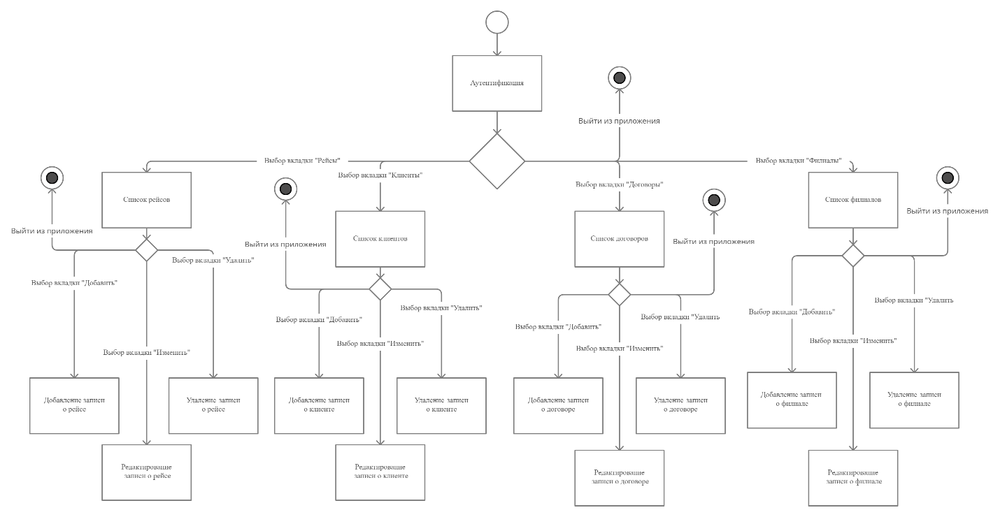
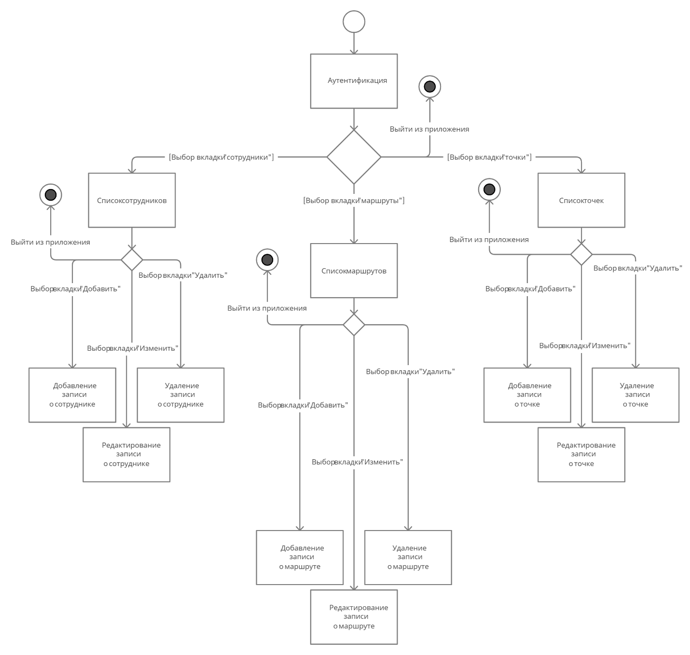
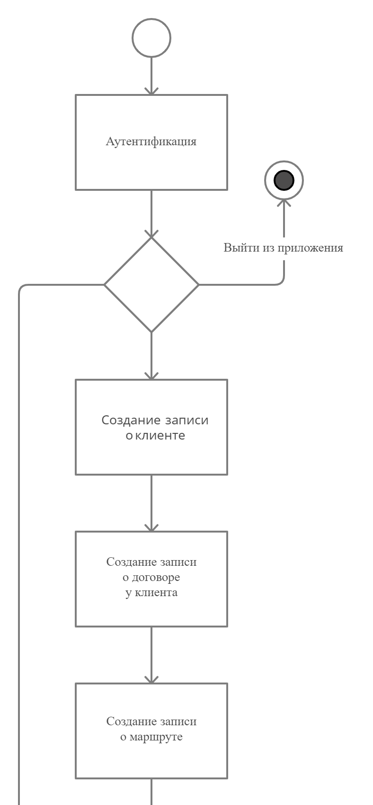

## Диаграммы действий

+ Полная диаграмма действий часть 1.

+ Полная диаграмма действий часть 2.
После открытия формы «Клиенты», работник нажимает на кнопку «Новый клиент» после этого сотрудник корректно заполняет данные и сохраняет его.

+ Диаграмма действий оформления договора и рейса часть 1.

+ Диаграмма действий оформления договора и рейса часть 2.
На рисунках 3 и 4 представлена основная составляющая деятельности организации – заключение договора и последующее создание рейса или рейсов для исполнения договора.
Предполагается, что клиент впервые обратился за услугой грузоперевозки. 
Также обозначим то что и маршрут, и точки используются впервые, соответственно их необходимо создать.
